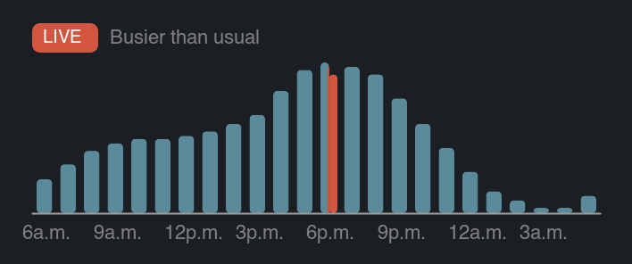

<p align="center">
  
</p>

<h1 align="center">GymPulse</h1>

<p align="center">
  <b>How busy is your gym <i>right now</i>? Glance at your Mac menu bar.</b><br>
  A dumbbell that fills up with the live crowd — powered by Google's Popular Times, no API keys, no paid services.
</p>

<p align="center">
  
  
  
  
</p>

---

## The idea

The dumbbell in your menu bar **is a gauge**. Empty outline = dead gym. Solid = packed. It refreshes every 30 minutes from Google's live data:

<p align="center">
  
</p>

Click it and you get a Google-style breakdown — the **red bar is the live crowd** vs. the teal typical curve, plus the least-busy hour left in your day:

<p align="center">
  
</p>

```
LIVE  Busier than usual
92% — busier than usual (typical: 65%)
[histogram: teal typical bars · red live bar · 6a.m.-first axis]
Best time to go: 9 p.m. today (~43%)
Open in Google Maps · Refresh · Updated 18:02
```

## Not just gyms

Point it at **any place Google tracks** — a café, supermarket, library, climbing wall, barbershop. If Google Maps shows a "Popular times" panel for it, GymPulse can watch it. Three lines in [`fetcher/config.py`](fetcher/config.py):

```python
PLACE_NAME = "Fitness24Seven Quinta Paredes"                 # display name
PLACE_SEARCH_QUERY = "Fitness24Seven Quinta Paredes Bogota"  # what you'd type into Google
PLACE_ADDRESS = "Calle 24, Av. La Esperanza #43 A 90, ..."   # for the Maps link
```

Then `./install.sh` — done.

## How it works

```
launchd (every 30 min)
  └─ fetcher.py
       ├─ scrape/live.py ─── your real Chrome (headless) ──> Google "Popular times"
       │                     └─ live red bar + typical curve + busier/quieter verdict
       ├─ falls back to WEEKLY_CURVE forecast if the scrape fails (never breaks)
       └─ writes ~/.gympulse/latest.json + histogram.png
                    ▲
       SwiftBar plugin (read-only, instant) ──> menu-bar gauge + dropdown
```

**Why a real Chrome?** Google strips Popular Times from headless/bot browsers and paid APIs charge for it. A persistent profile with your installed Chrome gets served the same live data you see when you search — details in [`scrape/README.md`](scrape/README.md).

**Fail-soft everywhere.** Scraper down, CAPTCHA, no Chrome, malformed config — the app degrades to the self-tuned forecast and the menu bar keeps working. A cracked dumbbell means a genuine error.

## Install

```bash
brew install --cask swiftbar google-chrome   # once
git clone https://github.com/fsalamancar/gympulse && cd gympulse
./install.sh
```

`install.sh` deploys the runtime to `~/.gympulse` (outside macOS-protected folders — no recurring permission prompts), loads the 15-min launchd agent, and installs the SwiftBar plugin. Re-run it after changing config.

<details>
<summary><b>Developing</b></summary>

```bash
uv venv && uv pip install -e . --group dev
uv run pytest                      # 39 tests
bash assets/build_icons.sh         # regenerate gauge glyphs from the sprite sheet
uv run python -m fetcher.gym_busy  # CLI view (--week for the full heatmap)
```
</details>

## Tune it — `fetcher/config.py`

| Setting | What it does |
|---|---|
| `PLACE_*` | The venue to watch (any place with Popular Times) |
| `GO_START` / `GO_END` | Your availability — "Best time to go" only recommends these hours |
| `WEEKLY_CURVE` | Fallback forecast, 0–100 per hour per day — tune it to how the place feels |
| `QUIET` / `MODERATE` | Busyness thresholds (≤33 quiet · ≤66 moderate · busy) |
| `TZ` | The venue's timezone |
| `USE_LIVE_SCRAPE` | Turn the live scrape off to run purely on your forecast |

## Project layout

```
fetcher/     data layer: config, derivation logic, fetcher, histogram renderer
scrape/      live Google Popular Times via your real Chrome (fail-soft)
swiftbar/    the menu-bar plugin (read-only; never scrapes)
assets/      icon sprite sheet + build script + gauge glyphs
launchd/     the 15-min background agent
GymPulse/    Phase 3: WidgetKit widget scaffold (deferred)
```

## License

[MIT](LICENSE) — built by [Francisco Salamanca](https://github.com/fsalamancar).
